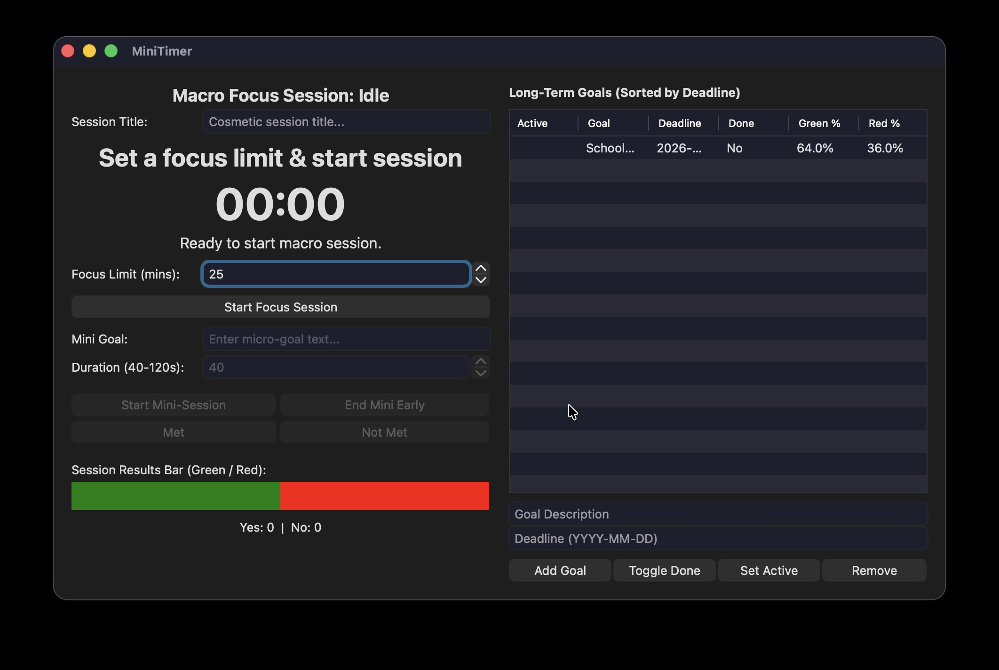

# MiniTimer

**This cross-platform app was deployed with [Briefcase](https://briefcase.beeware.org/) - part of
[The BeeWare Project](https://beeware.org/). If you want to see more tools like Briefcase, please
consider [becoming a financial member of BeeWare](https://beeware.org/membership).**

(I'm not affiliated with that project at all.  plus the UI is built with Toga which is also part of BeeWare)

My first entirely vibecoded application, using Gemini

